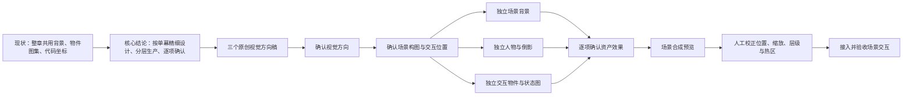

# 《我》原创视觉方向规范

版本：v0.1

日期：2026-08-07

适用范围：Stage 3 单幕样板及后续全部场景、人物、交互物件和状态图

图注：每个确认节点都是进入下一阶段的门槛，不用批量生产代替视觉判断。

## 1. 核心方向

《我》的画面应当先让人相信这是一个真实、普通、可以生活的空间，再让想象从灯光、倒影、纸页、声音和物件关系里慢慢浮现。奇幻不以传送门、粒子爆发或宏大景观出现，而像主角重新注意到世界以后，现实自己多露出了一层意思。

视觉语言使用原创手绘二维动画方向：

- 清楚、自然、有轻重变化的铅笔或色铅笔轮廓。
- 透明水彩铺陈空间，局部以哑光水粉稳定形体和光线。
- 人物比例柔和但可信，动作来自日常观察，不使用偶像化或夸张动漫姿势。
- 自然光和实际光源决定颜色；暖色只在感知变化处少量出现。
- 保留手绘边缘和适度笔触，不叠加覆盖全图的高强度纸纹或噪点。
- 画面细节服务空间、人物和交互，不追求无差别的满幅精细。

## 2. 参考转译与原创边界

用户偏好的电影感转译为以下高层特征：手绘动画背景、生活化空间、温暖自然光、柔和人物造型、环境细节有生命感，以及现实中逐渐浮现的克制奇幻。

不得进入提示词或最终资产的内容：

- 不要求复制任何在世艺术家的独特画风。
- 不复刻具体动画工作室的角色比例、线条模板、色彩脚本或场景设计。
- 不使用现有电影角色、服装、交通工具造型、建筑、道具、镜头构图或标志性动作。
- 不使用“某部电影同款”“某角色版本”“看起来就是某工作室作品”等验收口径。
- 第三章继续严格排除已有漫画、动画和游戏角色的高相似设计。

验收只依据本文件的可观察特征和母本叙事，不以“像不像某位作者”作为判断标准。

## 3. 三个方向稿

三个方向稿使用同一个 `c01_s02_commute_window` 构图，只改变视觉语言。

当前评审状态：2026-08-10，用户选定原 C v001 的视觉语言、镜头和交通空间作为唯一参考，尤其确认焦点黑车迎面、右侧红车同向远离的车辆方向。该图人物身份错误，因此状态为 `reference_only`，不是正式资产。A/B/C v002 不再采用；v003 至 v006 依次暴露人物身份、身体朝向、玻璃边界、衣着、手机和尬笑问题；v007 仍显僵硬且倒影偏清晰。v008 进一步弱化倒影但预览仍偏写实、年龄偏大，未复制进工程。约五岁、概括手绘造型、无笑容自然关注和更弱反射的 `direction_selected_v009.png` 已确认为后续背景灰稿、人物与倒影资产的视觉基准。

### A. 明亮手绘动画

文件：`../game/assets/art/style-studies/c01_s02/direction_a_v002.png`

状态：`rejected`，道路与车辆方向关系未通过本轮确认。

- 线条：清楚、柔软、带少量铅笔起伏。
- 色彩：透明水彩空间加克制水粉重点。
- 光线：雨夜蓝灰与儿童倒影附近的微弱暖光自然过渡。
- 优点：人物、空间和交互物可读性最平衡，适合连续五章。
- 风险：若细节过多，仍可能回到当前背景信息密度过高的问题。

### B. 轻盈水彩绘本

文件：`../game/assets/art/style-studies/c01_s02/direction_b_v002.png`

状态：`rejected`，道路与车辆方向关系未通过本轮确认。

- 线条：更细、更松，允许局部边缘消失在水彩里。
- 色彩：浅雨蓝、灰绿、暖白和低饱和桃色，留白更多。
- 光线：柔和、空气感强，情绪最温柔。
- 优点：亲近、呼吸感好，资产叠加时不容易变脏。
- 风险：车辆阵营、柜内躲藏等机制可能缺少足够的形体和对比。

### C. 图形化赛璐珞与水粉

构图参考：`../game/assets/art/style-studies/c01_s02/direction_c_v001_composition_reference.png`

已确认人物与合成关系参考：`../game/assets/art/style-studies/c01_s02/direction_selected_v009.png`

状态：`approved` 视觉与构图基准；进入无人物背景构图灰稿评审。

- 线条：轮廓最明确，形体经过简化。
- 色彩：哑光水粉色块与少量赛璐珞阴影，纹理最克制。
- 光线：电影感更强，冷暖分区更清楚。
- 优点：生产拆层、状态图和触控可读性最好。
- 风险：如果阴影过深或色块过硬，会失去母本需要的温柔和不确定感。

## 4. 人物规范

### 成年主角

- 普通东亚成年男性，不设计成职业英雄、文艺偶像或时尚角色。
- 身形与姿态略收，肩膀和视线体现疲惫，但不病态、不绝望。
- 服装采用无品牌的当代基础款，颜色不抢占交互物和环境光。
- 脸部信息足够支撑抬头、观察和轻微放松，不依赖夸张表情。
- 每个场景先确认轮廓、身体重心、视线和手部动作，再确认服装细节。

### 儿童形态与倒影

- 是同一个人约五岁时的童年版本，保留可辨认的脸型、发型方向和姿态呼应。
- 身体朝向与头部转向分开约束：成年人和儿童的骨盆、躯干、胸口与双肩都朝车前方（画面正面）；成年人只把头转向右侧玻璃，儿童倒影只把头转向左侧看回成年人。
- 儿童穿无品牌圆领卫衣、针织衫等年龄合适的日常基础款，不复制成年人的工作衬衫；手中不拿手机或其他道具。
- 轻快感来自松弛眉眼、突然亮起的自然关注与轻微面颊变化，嘴唇微张或接近中性，不使用任何主动笑容、标准嘴角上扬、抿嘴笑或面对镜头式表情。
- 五岁比例使用圆润面颊、短下颌、小鼻口、较高额头和窄肩颈，线条与明暗比成年人更概括；不做写实缩小成人脸，也不使用大眼、Q 版或吉祥物比例。
- 不允许把儿童整个身体转成左侧面，也不允许使用独立视线、明显偏低的站立位置、成人化衣着、疲惫严肃神情或僵硬尬笑。
- 不使用可爱吉祥物比例，不放大眼睛或头部来制造幼态。
- 倒影以约实体人物四分之一视觉强度的运行时低不透明度、低饱和度、低局部对比、大面积消失边缘、混合模式和暖光控制，让雨滴、车灯与街景明显穿过人物；不把固定半透明效果烘焙进背景。合成时必须使用车窗玻璃内轮廓硬遮罩，任何儿童像素不得覆盖窗框、金属窗台或车厢实体表面。

### 一致性锚点

正式生产前建立成年主角与儿童形态的正面、侧面、坐姿和基础配色锚点。后续生成必须使用已确认锚点作为身份参考，不能逐幕重新设计人物。

## 5. 场景规范

- 每幕拥有自己的场景构图，不再用一张章节主背景覆盖六幕。
- 背景只包含不可移动、不可替换的建筑和环境结构。
- 人物、近景焦点物、可交互物件、状态变化和主要光效默认独立分层。
- 固定视角先解决透视、人物比例、承载面和遮挡，再添加气氛细节。
- 互动区域必须有可读轮廓和合理空隙，不能靠悬空图标或文字按钮指示。
- 叙事字幕安全区、顶部导航安全区和可触控区域在构图阶段一起校验。

## 6. 交互物件规范

- 一个可交互物件一个独立源文件；只有不可分割的状态序列可以组成同物件状态表。
- 默认输出带 Alpha 的 PNG，不使用 RGB 图集加运行时色键作为正式方案。
- 同一物件的状态图保持完全一致的画布、锚点、比例、视角和光向。
- 物件必须能落在可信承载面上，并与背景透视和人物比例一致。
- 视觉尺寸与命中尺寸分别记录；命中范围可以更宽容，但不能跨入无关物件。
- 交互反馈优先修改物件本身、局部光线或倒影，不在画面上增加通用按钮。

## 7. 技术规格

- 运行逻辑画布：720 × 1280。
- 正式场景背景源文件：1440 × 2560 或更高的同等 9:16 画幅，最终导入 PNG。
- 方向稿允许使用生成工具的原生竖幅尺寸，但评审预览统一裁切到 9:16。
- 人物源文件：透明 PNG，画布至少覆盖目标显示尺寸的两倍，保留完整轮廓与安全留白。
- 交互物件源文件：透明 PNG，常规物件长边至少 512 像素，关键近景物件长边至少 1024 像素。
- 所有文件使用 sRGB；不在位图中烘焙 UI、可读文字、水印、商标或点击光圈。
- 文件名使用小写英文和下划线，状态与版本明确，例如 `char_adult_seated_look_up_v001.png`。

## 8. 视觉验收清单

单项资产只有同时满足以下条件才能标记为 `approved`：

- 与母本和场景脚本表达的情绪一致。
- 不是对具体艺术家、工作室、电影角色或镜头的复制。
- 人物身份、空间透视、比例、视线和承载关系可信。
- 交互目标在手机实际显示尺寸下可辨认，但没有刻意发光或按钮化。
- 背景、人物和物件可以独立替换，边缘与遮挡关系可控。
- 颜色、光向、材质和线条与已锁定方向一致。
- 文件规格、透明度、命名、锚点和版本信息完整。
- 合成预览和 Godot 实机预览均通过，不只检查单张原图。
